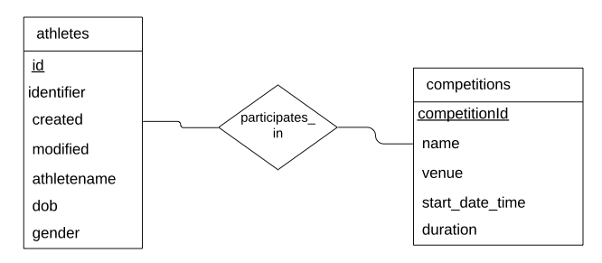
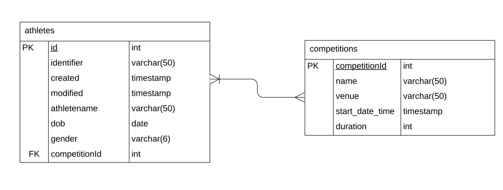
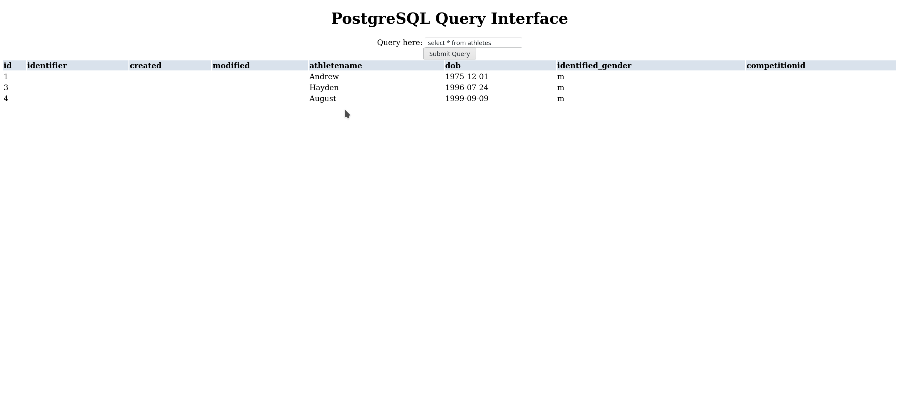
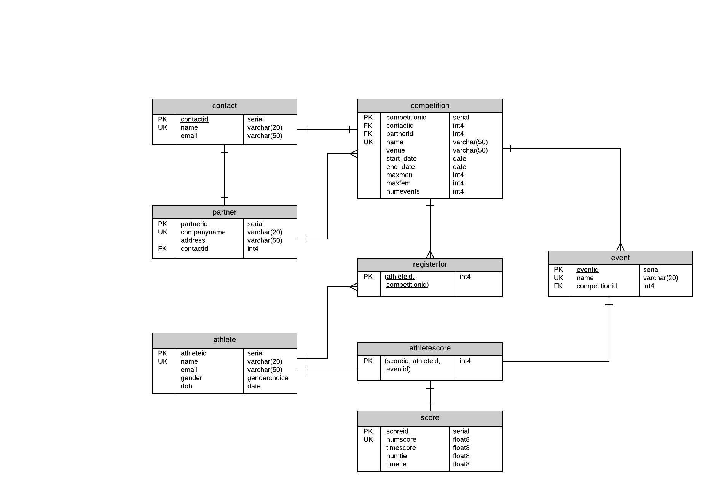

# CSI2532 - Bases de Données I

## Outline

| Outline | Value |
| --- | --- |
| Course | CSI 2532 |
| Date | Winter 2020 |
| Professor | [Andrew Forward](aforward@uottawa.ca) |
| Team | Ali Haidar 8328785<br> Ivor Benderavage 8171462<br> Haifa Besrour 300102272<br> |


# Deliverable 1

Below are different models and SQL queries that can be used on our database

## ER Model


## Relational Model


## SQL Schema

```sql
CREATE TABLE athletes (
  id int,
  identifier varchar(50),
  created timestamp,
  modified timestamp,
  name varchar(50),
  dob date,
  identified_gender varchar(6),
  PRIMARY KEY (id)
);
```

## Example SQL Queries

### INSERT

```sql
INSERT INTO athletes (id, name, identified_gender, dob)
VALUES
(1, 'Andrew', 'm', '1975-12-01'),
(2, 'Ayana', 'F', '1998-06-11'),
(3, 'Hayden', 'm', '1996-07-24'),
(4, 'August', 'm', '1999-09-09');
```

### SELECT 

```sql
SELECT *
FROM athletes
WHERE identified_gender = 'F';
```

### UPDATE

```sql
UPDATE athletes
SET identified_gender = 'M'
WHERE identified_gender = 'm';
```

### SELECT

```sql
SELECT *
FROM athletes
WHERE identified_gender = 'M';
```

### DELETE

```sql
DELETE FROM athletes;
```

### SELECT

```sql
SELECT count(*)
FROM athletes;
```

# Deliverable 2

Below are different models and SQL queries that can be used on our database

## ER Model



## Relational Model




## SQL Schema

The [schema](https://github.com/professor-forward/projet-csi2532_team/tree/master/db/schema.sql) is also available.


## Example SQL Queries

The SQL queries can also be found [here](https://github.com/professor-forward/projet-csi2532_team/tree/master/db/seed.sql)

## Migrations 

Our [migrations](https://github.com/professor-forward/projet-csi2532_team/tree/master/db/migrations) can also be accessed


## Application

Our application is a PHP frontend for the PostgreSQL database which can be used to perform read-only queries on the database.

Setup instructions on Linux:


1. Install and set up postgreSQL [(Instructions for Arch Linux here)](https://wiki.archlinux.org/index.php/PostgreSQL).  (Or use an installation wizard)

* Follow the instructions to create a user and a DB.  Create a user called `webuser` and a database called `TestSql`

2. Run `permissions.sql`.  This will give the `webuser` user the permissions we want (i.e. read-only queries only!)

3. Add our tables to the database by running `schema.sql`

4. Populate the database by running `seed.sql` or entering information manually

5. Start the local PHP server:

```
php -S 127.0.0.1:7000 application/index.php
```

6. Navigate to http://localhost:7000 in your browser to access the app.





# Deliverable 3

Below are different models and SQL queries that can be used on our database

## ER Model

INSERT NEW ER DIAGRAM HERE

## Relational Model




## SQL Schema

The [schema for delivrable 3](https://github.com/professor-forward/projet-csi2532_team/tree/master/db/Updatedschema.sql) is also available.


## Database Seed

The [seed ](https://github.com/professor-forward/projet-csi2532_team/blob/master/db/UpdatedSeed.sql) used to populate de database.


## Application
